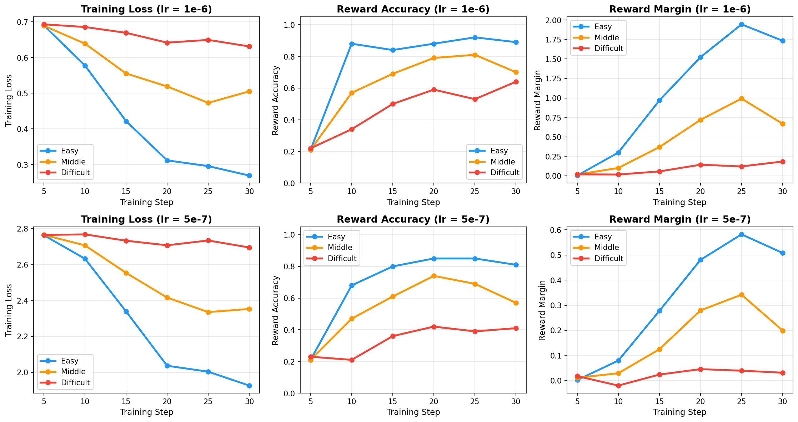

# Rebuttal Data Sources & Provenance

Last updated: 2026-03-30

## UltraInteract Eval Results (Eurus-7B LoRA)

### Results Table (6 selected tasks, used in rebuttal Q7)

| Method | GSM8K | MathQA | Minerva Math | MMLU-Pro Math | BBH | ARC | **Avg** |
|---|---|---|---|---|---|---|---|
| *SFT (ref.)* | *61.3±1.3* | *38.6±0.9* | *17.6±0.5* | *23.5±1.2* | *57.5±0.5* | *57.6±1.4* | *42.69* |
| DPO | 27.4±1.2 | 32.9±0.9 | 9.1±0.4 | 7.3±0.7 | 17.9±0.4 | 55.6±1.5 | 25.03 |
| SimPO | 47.0±1.4 | 34.1±0.9 | 9.4±0.4 | 11.3±0.9 | 12.2±0.4 | 56.1±1.5 | 28.36 |
| SelectiveDPO | **61.8±1.3** | 36.0±0.9 | 13.3±0.5 | 18.7±1.1 | 37.4±0.5 | 57.4±1.4 | 37.43 |
| MixDPO | 61.1±1.3 | **36.4±0.9** | **13.3±0.5** | **18.7±1.1** | **45.4±0.6** | **58.3±1.4** | **38.87** |

### Model Checkpoints
- Base model: `openbmb/Eurus-7b-SFT`
- SFT: base model, no adapter
- DPO: `/mnt/data1/jinlong/CL_DPO_outputs/eurus-7b-ultrainteract-dpo-full-lora`
- SelectiveDPO: `/mnt/data1/jinlong/CL_DPO_outputs/eurus-7b-ultrainteract-selectivedpo-full-lora`
- MixDPO: `/mnt/data1/jinlong/CL_DPO_outputs/eurus-7b-ultrainteract-mixdpo-full-lora`
- SimPO: `/mnt/data1/jinlong/CL_DPO_outputs/eurus-7b-ultrainteract-simpo-full-lora`

### Training Configs
- Directory: `training_configs/cl_ultrainteract_math_cot/`
- Dataset: `jlpang888/ultrainteract_math_cot_sorted_20k` (HuggingFace)

### Eval Result JSONs
| Benchmark | Result Directory | Eval Script |
|---|---|---|
| GSM8K, MATH, ASDiv, GSM+ | `eval_results/ultrainteract_math_lora/` | `run_ultrainteract_eval_lora.sh` |
| MathQA | `eval_results/ultrainteract_mathqa/` | `run_ultrainteract_eval_mathqa.sh` |
| BBH, ARC | `eval_results/ultrainteract_bbh_arc/` | `run_ultrainteract_eval_bbh_arc.sh` |
| Minerva Math | `eval_results/ultrainteract_minerva_math/` | `run_ultrainteract_eval_minerva_math.sh` |
| MMLU-Pro Math | `eval_results/ultrainteract_mmlu_pro_math/` | `run_ultrainteract_eval_mmlu_pro_math.sh` |
| AQuA, SAT Math | `eval_results/ultrainteract_aqua_sat/` | `run_ultrainteract_eval_aqua_sat.sh` |

### Metric Keys Used
| Task | Metric Key |
|---|---|
| GSM8K | `exact_match,flexible-extract` |
| MathQA | `acc_norm,none` |
| Minerva Math | `math_verify,none` |
| MMLU-Pro Math | `exact_match,custom-extract` |
| BBH | `exact_match,get-answer` |
| ARC | `acc_norm,none` |
| MATH (hendrycks) | `exact_match,none` |
| ASDiv | `acc,none` |
| GSM+ | `exact_match,flexible-extract` |

### Wandb Training Runs
- Entity: `jlpang863-university-of-california`
- Project: `huggingface`
- DPO LoRA: run id `4qxv9qzw`
- SelectiveDPO LoRA: run id `d1hlh9jf`
- MixDPO LoRA: run id `d20m7p6c`
- SimPO LoRA: run id `fmcy9uyx`

---

## Easy/Middle/Difficult Subset LR Sweep (Reviewer Tgvs Q3)

### Model Checkpoints
- lr1 (1e-6):
  - Easy: `/mnt/data1/jinlong/CL_DPO_outputs/llama-3-8b-dpo-sorted-score-diff-easy-5k-full-lr1`
  - Middle: `/mnt/data1/jinlong/CL_DPO_outputs/llama-3-8b-dpo-sorted-score-diff-middle-5k-full-lr1`
  - Difficult: `/mnt/data1/jinlong/CL_DPO_outputs/llama-3-8b-dpo-sorted-score-diff-difficult-5k-full-lr1`
- lr2 (5e-7):
  - Easy: `/mnt/data1/jinlong/CL_DPO_outputs/llama-3-8b-dpo-sorted-score-diff-easy-5k-full-lr2`
  - Middle: `/mnt/data1/jinlong/CL_DPO_outputs/llama-3-8b-dpo-sorted-score-diff-middle-5k-full-lr2`
  - Difficult: `/mnt/data1/jinlong/CL_DPO_outputs/llama-3-8b-dpo-sorted-score-diff-difficult-5k-full-lr2`

### Training Configs
- lr1: `training_configs/cl_cases/llama-3-8b-base-dpo-sorted-score-diff-{easy,middle,difficult}-5k-full-lr1.yaml`
- lr2: `training_configs/cl_cases/llama-3-8b-base-dpo-sorted-score-diff-{easy,middle,difficult}-5k-full-lr2.yaml`

### Wandb Training Runs
| Run Name | Run ID | LR |
|---|---|---|
| llama-3-8b-base-dpo-sorted-score-diff-easy-5k-full-lr1 | `e17xoxhc` | 1e-6 |
| llama-3-8b-base-dpo-sorted-score-diff-middle-5k-full-lr1 | `fxtg6o9l` | 1e-6 |
| llama-3-8b-base-dpo-sorted-score-diff-difficult-5k-full-lr1 | `kq2ytc53` | 1e-6 |
| llama-3-8b-base-dpo-sorted-score-diff-easy-5k-full-lr2 | `0xw9h1pz` | 5e-7 |
| llama-3-8b-base-dpo-sorted-score-diff-middle-5k-full-lr2 | `6mh0ck4u` | 5e-7 |
| llama-3-8b-base-dpo-sorted-score-diff-difficult-5k-full-lr2 | `r469v6ac` | 5e-7 |

### AlpacaEval Results
| Subset | lr=1e-6 LC WR (%) | lr=5e-7 LC WR (%) |
|---|---|---|
| Easy 5k | 4.37 | pending (API key issue) |
| Middle 5k | 4.39 | pending (API key issue) |
| Difficult 5k | 2.27 | pending (API key issue) |

- lr1 results from: `rebuttal_icml26/alpaca_eval_all_results.csv`
- lr2 generations completed at: `/home/jlpang/alpaca_eval/model_outputs_cl/llama-3-8b-dpo-sorted-score-diff-{easy,middle,difficult}-5k-full-lr2/model_outputs_full.json`
- GPT-4.1 evaluation pending (OPENAI_API_KEY needs refresh)

### Training Dynamics Figure

- File: `rebuttal_icml26/figures/training_dynamics_lr_comparison.png`
- Raw data: `rebuttal_icml26/figures/training_dynamics_data.json`
- Data source: wandb runs listed above
- Layout: 2 rows (lr=1e-6, lr=5e-7) x 3 cols (Training Loss, Reward Accuracy, Reward Margin)
- Note: lr=5e-7 loss scale differs from lr=1e-6 due to transformers version difference (4.46 vs 4.51)

### Training Dynamics Summary (from wandb)

**lr = 1e-6 (6 training steps)**:
| Metric | Easy | Middle | Difficult |
|---|---|---|---|
| Loss (start -> end) | 0.69 -> 0.27 | 0.69 -> 0.51 | 0.69 -> 0.63 |
| Reward Acc (start -> end) | 0.21 -> 0.89 | 0.21 -> 0.70 | 0.22 -> 0.64 |
| Reward Margin (start -> end) | 0.003 -> 1.73 | 0.017 -> 0.67 | 0.019 -> 0.18 |

**lr = 5e-7 (6 training steps)**:
| Metric | Easy | Middle | Difficult |
|---|---|---|---|
| Reward Acc (start -> end) | 0.21 -> 0.82 | 0.21 -> 0.76 | 0.22 -> 0.42 |
| Reward Margin (start -> end) | 0.003 -> 0.58 | 0.017 -> 0.19 | 0.019 -> 0.04 |

---

## Other LR Sweep Experiments (for reference)

### LLaMA-3-8B MixDPO LR Sweep (AlpacaEval)
| Config | LR | LC WR (%) | Source |
|---|---|---|---|
| ours4-6-sorted-score-diff-full-lr1 | 5e-7 | 9.96 | alpaca_eval_all_results.csv |
| ours4-6-sorted-score-diff-full-lr2 | 2e-7 | 7.26 | alpaca_eval_all_results.csv |
| ours4-6-sorted-score-diff-full-lr3 | 2e-6 | 4.42 | alpaca_eval_all_results.csv |

### Mistral-7B MixDPO LR Sweep (AlpacaEval)
| Config | LR | LC WR (%) | Source |
|---|---|---|---|
| new-base-full-lr5 | 2e-7 | 7.67 (best) | alpaca_eval_all_results.csv |
| new-base-full-lr5-replicate | 2e-7 | 8.45 | alpaca_eval_all_results.csv |
| new-base-full-lr6 | 3e-7 | 6.99 | alpaca_eval_all_results.csv |
| new-base-full-lr8 | 1e-7 | 6.99 | alpaca_eval_all_results.csv |
